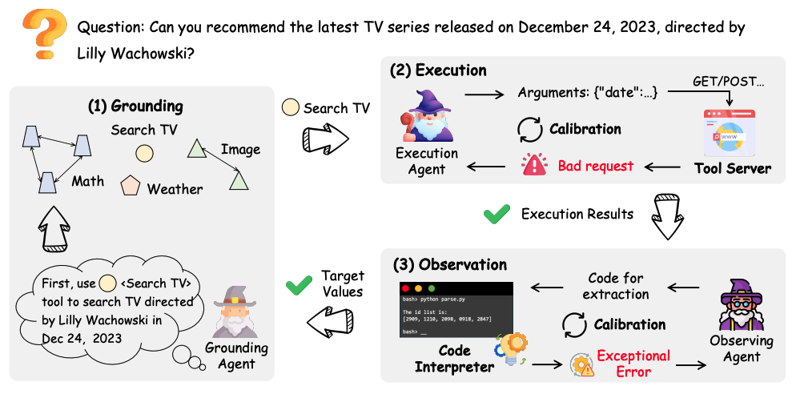
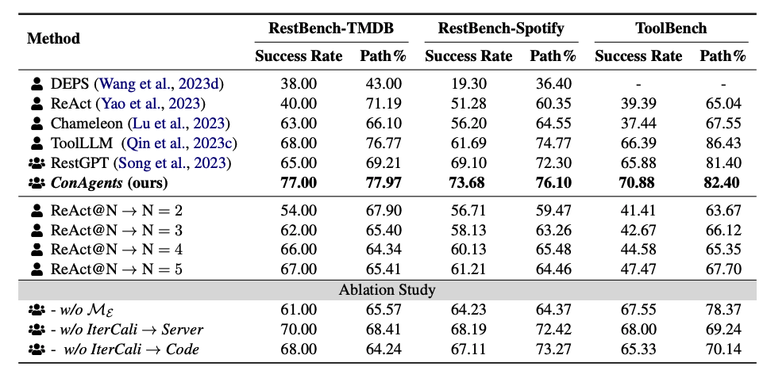

# CoAgents
The code for "cooperative and interactive agents framework"

We propose the ConAgents, a **Co**operative and i**n**teractive **agents** framework . The grounding agent generates tool-use instructions while execution agent executes selected tools. The observing agent extracts relevant values from execution results. When receiving feedback from the tool environment, the execution agent and observing agent adapt themselves iteratively.






# Quick start

- install the main library via `pip install`

```txt
langchain==0.0.338 # new version is also allowed
colorama==0.4.6
tiktoken==0.5.1
openai==1.7.1
```


- register the TMDB platform to get the access token to access the TMDB APIs. 
  Once you get the access token, please make a new file named `access_token.txt ` and add your token into this file.

  

- get the OpenAI API to use the `gpt-3.5-turbo` (or other models)

  Once your get the APIs, please add your APIs into the list in `./utilize/apis.py`.

  ```python
  api_keys_list = [
      'add your APIs'
  ]
  ```

  You can add multiple APIs since we will randomly select one APIs from api_keys_list to request the OpenAI backend for each API request. The Random selection strategy is employed to improve the quota limitation for one API (see the OpenAI quota for the details).

  You can also configure the base URL for your OpenAI APIs

  ```python
  BASE_URL = 'customize your own API base url' # https://api.openai.com/v1
  ```


- Run our demo `run_tmdb.py`

```txt
python run_tmdb.py \
--model_name 'gpt-3.5-turbo' \
--log_file './log_file.json'  \
--data_file <your dataset file> \
--access_token_file <the file containing your access token of the TMDB platform>
```


# Todo

We will add more details as soon as possible.

# citation

```txt
@article{shi2024learning,
  title={Learning to Use Tools via Cooperative and Interactive Agents},
  author={Shi, Zhengliang and Gao, Shen and Chen, Xiuyi and Yan, Lingyong and Shi, Haibo and Yin, Dawei and Chen, Zhumin and Ren, Pengjie and Verberne, Suzan and Ren, Zhaochun},
  journal={arXiv preprint arXiv:2403.03031},
  year={2024}
}
```
